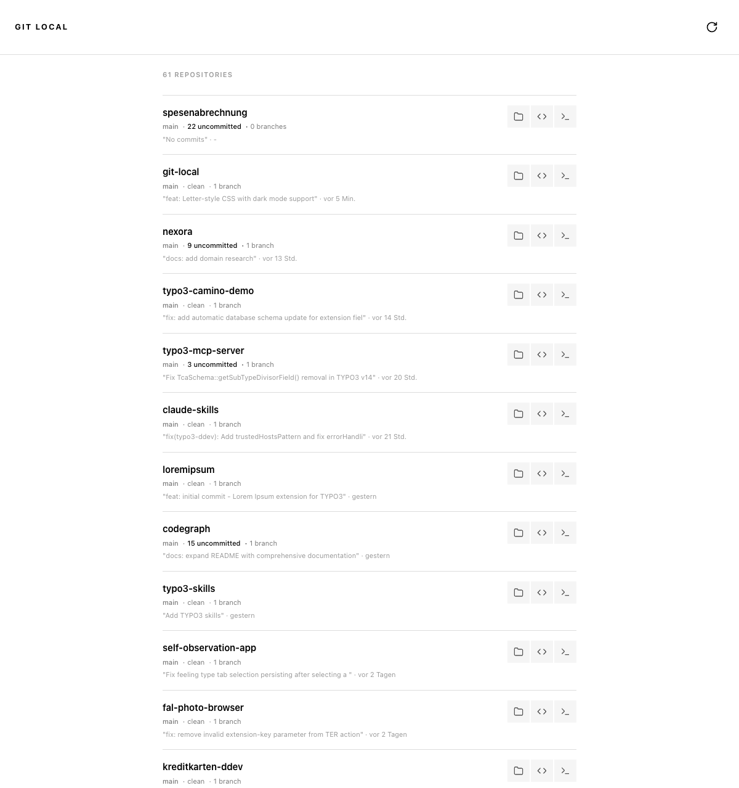

# git-local

A local web interface for browsing and managing Git repositories.

## Features

- Scan and list all Git repositories in a directory
- Show branch, status (clean/dirty), last commit, remote URL
- Detect project types: DDEV, Docker, Python, Node, PHP, Go, Rust, TYPO3
- Quick actions: Open in VS Code, Terminal, or Finder
- Filter repositories by name or badge
- Sort by name (A-Z), date, or remote
- Dark mode (auto + manual toggle)
- i18n: German and English

## Screenshot



## Requirements

- Python 3.11+
- [uv](https://github.com/astral-sh/uv) package manager

## Installation

```bash
git clone https://github.com/dkd-dobberkau/git-local.git
cd git-local
uv sync
```

## Usage

```bash
./start.sh   # Start server
./stop.sh    # Stop server
```

Or manually:

```bash
uv run uvicorn git_local.main:app --host 127.0.0.1 --port 1899
```

Open http://localhost:1899

## Configuration

Edit `src/git_local/config.py` to change:

- `REPO_BASE_PATH` – Directory to scan (default: `/Users/olivier/Versioncontrol/local`)
- `PORT` – Server port (default: `1899`)

## Tech Stack

- **Backend:** FastAPI, GitPython, Jinja2
- **Frontend:** HTMX, vanilla CSS (Letter-style monochrome design)
- **Package Manager:** uv

## License

MIT License – see [LICENSE](LICENSE)
